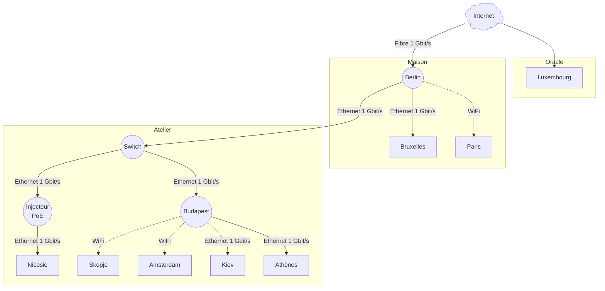

# 🗺️ Réseau

## 🌎 Schéma général

## 🧭 Détail

### 🗼 Infrastructure

**Plage d’adressage** : `192.168.0.1`–`192.168.0.20`

| Nom                                  | Adresse IP                        | Description                | Adresse MAC       |
| ------------------------------------ | --------------------------------- | -------------------------- | ----------------- |
| [Berlin](./inventaire.md#berlin)     | [192.168.0.1](http://192.168.0.1) | Routeur & passerelle 4G    | 88:40:3B:EA:10:46 |
| [Budapest](./inventaire.md#budapest) | [192.168.0.2](http://192.168.0.2) | Routeur wifi voiture/train |                   |
| [Chisinau](./inventaire.md#chisinau) | [192.168.0.3](http://192.168.0.3) | Antenne WiFi ext. caméras  | 60:A4:B7:39:6A:0E |

### 🌐 Serveurs

**Plage d’adressage** : `192.168.0.21`–`192.168.0.30`

| Nom                                      | Adresse IP                          | Description          | Adresse MAC |
| ---------------------------------------- | ----------------------------------- | -------------------- | ----------- |
| [Bruxelles](./inventaire.md#bruxelles)   | [192.168.0.21](http://192.168.0.21) | Serveur TrueNAS      |             |
| [Luxembourg](./inventaire.md#luxembourg) | [192.168.0.23](http://192.168.0.23) | Serveur Oracle Cloud |             |

### 🎥 Caméras

**Plage d’adressage** : `192.168.0.41`–`192.168.0.50`

| Nom                                    | Adresse IP                          | Description         | Adresse MAC       |
| -------------------------------------- | ----------------------------------- | ------------------- | ----------------- |
| [Nicosie](./inventaire.md#nicosie)     | [192.168.0.41](http://192.168.0.41) | Caméra jardin       | EC:71:DB:AC:02:02 |
| [Amsterdam](./inventaire.md#amsterdam) | [192.168.0.42](http://192.168.0.42) | Caméra portail haut | C4:3C:B0:F1:8C:C7 |
| [Skopje](./inventaire.md#skopje)       | [192.168.0.43](http://192.168.0.43) | Caméra cours        | 00:BF:AF:D5:A2:5C |

### 🖨️ Imprimantes

**Plage d’adressage** : `192.168.0.51`–`192.168.0.60`

| Nom                              | Adresse IP                           | Description             | Adresse MAC       |
| -------------------------------- | ------------------------------------ | ----------------------- | ----------------- |
| [Madrid](./inventaire.md#madrid) | [192.168.0.51](https://192.168.0.51) | Imprimante chambre Alix | 38:9D:92:07:EB:DC |
| [Kiev](./inventaire.md#kiev)     | [192.168.0.52](https://192.168.0.52) | Imprimante atelier      |                   |

### ➕ Autres (DHCP)

**Plage dynamique (DHCP)** : `192.168.0.100`–`192.168.0.254`
Affectée à : téléphones, objets connectés, ordinateurs…

| Nom                                | Type            |
| ---------------------------------- | --------------- |
| [Paris](./inventaire.md#paris)     | Desktop         |
| [Londres](./inventaire.md#londres) | Laptop          |
| [Athènes](./inventaire.md#athenes) | Desktop Atelier |
| [Rome](./inventaire.md#rome)       | Laptop          |
| …                                  | Mobile/IoT      |

_Voir [inventaire.md](./inventaire.md) pour la liste détaillée complète et les descriptions individualisées._
