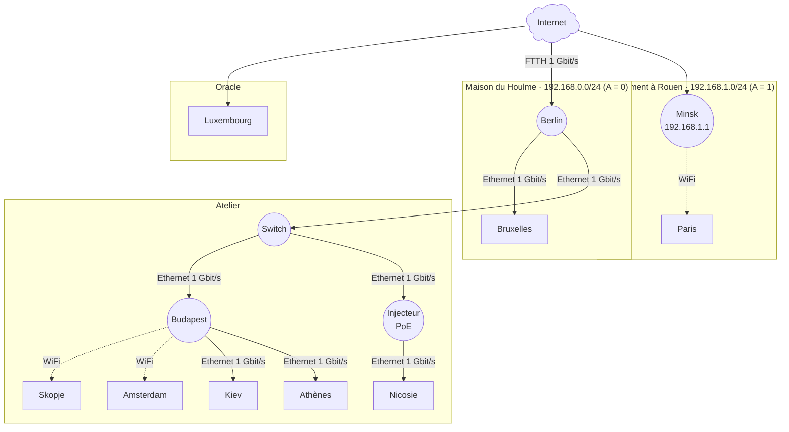

# 🗺️ Réseau

## 🌎 Schéma général

```mermaid
flowchart TB

	Internet@{ shape: cloud } --> Luxembourg

	subgraph Oracle
		Luxembourg
	end

	Internet --"FTTH 1 Gbit/s"--> Berlin((Berlin))
	Internet --> Minsk((Minsk<br/>192.168.1.1))

	subgraph Maison["Maison du Houlme · 192.168.0.0/24 (A = 0)"]
		Berlin --"Ethernet 1 Gbit/s"--> Bruxelles
	end

	subgraph Rouen["Appartement à Rouen · 192.168.1.0/24 (A = 1)"]
		Minsk -."WiFi".-> Paris
	end

	subgraph Atelier
		Berlin --"Ethernet 1 Gbit/s"--> Switch((Switch))
		Switch --"Ethernet 1 Gbit/s"--> Budapest((Budapest))
		Switch --"Ethernet 1 Gbit/s"--> InjecteurPoE((Injecteur<br/>PoE))
		InjecteurPoE --"Ethernet 1 Gbit/s"--> Nicosie
		Budapest -."WiFi".-> Skopje
		Budapest -."WiFi".-> Amsterdam
		Budapest --"Ethernet 1 Gbit/s"--> Kiev
		Budapest --"Ethernet 1 Gbit/s"--> Athènes
	end
```

## 🧭 Détail

### 🧩 Plan d’adressage commun

Plan par lieu : `192.168.A.0/24` (`A = 0` au Houlme, `A = 1` à Rouen). Sous-réseaux fonctionnels proposés, compatibles avec les adresses attribuées :

| Fonction                                    | Sous-réseau(x)     | Plage d’adresses utilisables    |
| ------------------------------------------- | ------------------ | ------------------------------- |
| Infrastructure                              | `192.168.A.0/28`   | `192.168.A.1`–`192.168.A.14`    |
| Serveurs                                    | `192.168.A.16/28`  | `192.168.A.17`–`192.168.A.30`   |
| Caméras                                     | `192.168.A.40/29`  | `192.168.A.41`–`192.168.A.46`   |
| Imprimantes et autres équipements statiques | `192.168.A.48/28`  | `192.168.A.49`–`192.168.A.62`   |
| Clients DHCP                                | `192.168.A.128/25` | `192.168.A.129`–`192.168.A.254` |

> Ces sous-réseaux fonctionnels sont proposés, pas configurés : le LAN du Houlme et son macvlan restent en `192.168.0.0/24` (passerelle `.254`). Leur séparation nécessiterait routage et passerelles dédiées, éventuellement des VLAN.

### 🔐 VPN mesh NetBird

NetBird utilise `100.64.0.0/24` (hôtes `100.64.0.1`–`100.64.0.254`), indépendamment des réseaux locaux.

### 🗼 Infrastructure

> **DHCP :** Berlin et Minsk servent chacun le DHCP de leur réseau local respectif. Les autres équipements réseau fonctionnent en pont L2, sans routage, NAT, VLAN ni DHCP.

| Nom                                  | Adresse IP                        | Description               | Adresse MAC       |
| ------------------------------------ | --------------------------------- | ------------------------- | ----------------- |
| [Berlin](./inventaire.md#berlin)     | [192.168.0.1](http://192.168.0.1) | Routeur fibre             | 88:40:3B:EA:10:46 |
| [Minsk](./inventaire.md#minsk)       | [192.168.1.1](http://192.168.1.1) | Routeur de l’appartement  |                   |
| [Budapest](./inventaire.md#budapest) | [192.168.0.2](http://192.168.0.2) | Routeur wifi atelier      |                   |
| [Chisinau](./inventaire.md#chisinau) | [192.168.0.3](http://192.168.0.3) | Antenne WiFi ext. caméras | 60:A4:B7:39:6A:0E |

### 🌐 Serveurs

| Nom                                      | Adresse IP                          | Description                                                                      | Adresse MAC |
| ---------------------------------------- | ----------------------------------- | -------------------------------------------------------------------------------- | ----------- |
| [Bruxelles](./inventaire.md#bruxelles)   | [192.168.0.21](http://192.168.0.21) | Serveur TrueNAS                                                                  |             |
| [Pristina](./inventaire.md#pristina)     | [192.168.0.22](http://192.168.0.22) | Serveur Debian de sauvegarde (virtualisé sur [Athènes](./inventaire.md#athenes)) |             |
| [Luxembourg](./inventaire.md#luxembourg) | [192.168.2.16](http://192.168.2.16) | Serveur Oracle Cloud                                                             |             |
| Home Assistant                           | [192.168.0.24](http://192.168.0.24) | Conteneur macvlan hébergé sur [Bruxelles](./inventaire.md#bruxelles)             |             |

### 🎥 Caméras

| Nom                                    | Adresse IP                          | Description         | Adresse MAC       |
| -------------------------------------- | ----------------------------------- | ------------------- | ----------------- |
| [Nicosie](./inventaire.md#nicosie)     | [192.168.0.41](http://192.168.0.41) | Caméra jardin       | EC:71:DB:AC:02:02 |
| [Amsterdam](./inventaire.md#amsterdam) | [192.168.0.42](http://192.168.0.42) | Caméra portail haut | C4:3C:B0:F1:8C:C7 |
| [Skopje](./inventaire.md#skopje)       | [192.168.0.43](http://192.168.0.43) | Caméra cours        | 00:BF:AF:D5:A2:5C |

### 🖨️ Imprimantes

| Nom                              | Adresse IP                           | Description             | Adresse MAC       |
| -------------------------------- | ------------------------------------ | ----------------------- | ----------------- |
| [Madrid](./inventaire.md#madrid) | [192.168.0.51](https://192.168.0.51) | Imprimante chambre Alix | 38:9D:92:07:EB:DC |
| [Kiev](./inventaire.md#kiev)     | [192.168.0.52](https://192.168.0.52) | Imprimante atelier      |                   |

### ➕ Autre - statique

| Nom                            | Adresse IP                          | Description          | Adresse MAC       |
| ------------------------------ | ----------------------------------- | -------------------- | ----------------- |
| [Paris](./inventaire.md#paris) | [192.168.1.61](http://192.168.1.61) | Ordinateur de bureau | 34:2E:B7:8A:D9:E1 |

_Voir [inventaire.md](./inventaire.md) pour la liste détaillée complète et les descriptions individualisées._
