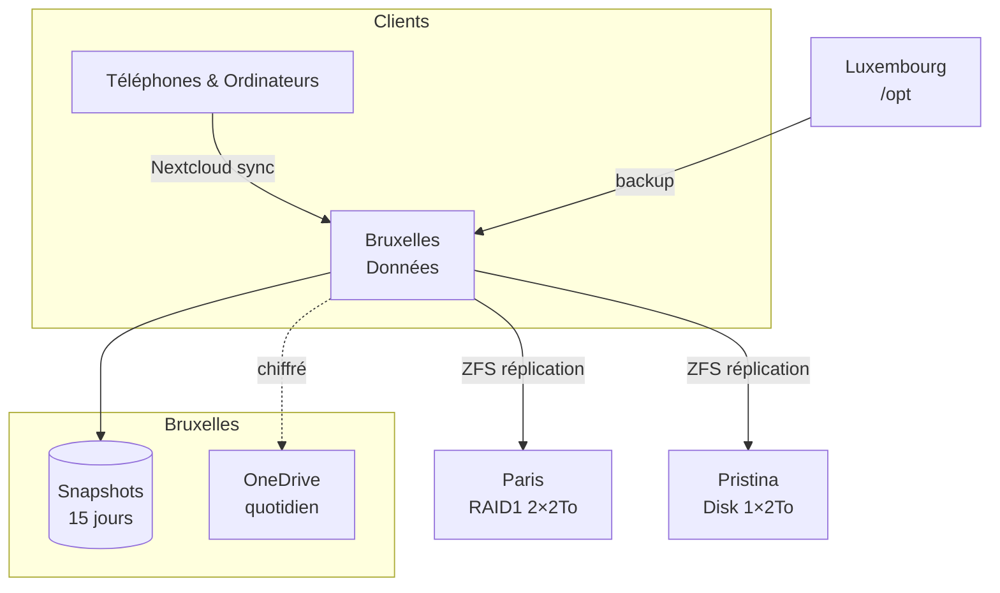

# 🛡️ Politique de sauvegarde

## 🌐 Schéma global

## 📋 Vue d'ensemble

| Cible                                           | Contenu                                                                  | Fréquence                            | Méthode                             |
| ----------------------------------------------- | ------------------------------------------------------------------------ | ------------------------------------ | ----------------------------------- |
| [Bruxelles](./inventaire.md#bruxelles)          | Dataset principal `Données` (4×2 To NVMe, RAIDZ1, partiellement chiffré) | —                                    | —                                   |
| Snapshots ZFS                                   | `Données`                                                                | Quotidienne                          | `zfs snapshot` (rétention 15 jours) |
| [Paris](./inventaire.md#paris)                  | Réplication `Données`                                                    | ~Quotidienne (déclenchée par script) | ZFS send/receive (inclut snapshots) |
| [Pristina](./inventaire.md#pristina)            | Réplication `Données`                                                    | ~Quotidienne (déclenchée par script) | ZFS send/receive (inclut snapshots) |
| OneDrive                                        | sync `Données`                                                           | Quotidienne                          | rclone (chiffrement côté client)    |
| [Luxembourg](./inventaire.md#luxembourg) `/opt` | Données Docker                                                           | —                                    | Backup vers Bruxelles               |
| Clients (Nextcloud)                             | Documents & Photos                                                       | continue                             | Nextcloud sync                      |

---

## 🔍 Détails

### 🖥️ Bruxelles – Dataset principal

- **Pool** : RAIDZ1 sur 4 × 2 To NVMe (Western Digital Black SN750/SN770/SN7100 + Micron 5200)
- **Dataset** : `Données` (unique, partiellement chiffré)
- **Snapshots** : quotidiens, rétention 15 jours (nom : `auto-YYYYMMDD`)

### 🌍 Réplication vers Paris & Pristina

- **Déclencheur** : script sur les postes distants (pull) qui lance `zfs receive` quand ils sont allumés
- **Inclus** : snapshots ZFS (réplication incrémentale)
- **Paris** : 2 × 2 To en ZFS RAID1 (mirror)
- **Pristina** : 1 × 2 To (disque unique)

### ☁️ OneDrive

- Sync quotidienne via **rclone** avec remote crypté
- Chiffrement côté client avant upload

### 🐳 Luxembourg – /opt

- Le dossier `/opt` (contenant les données des conteneurs Docker) est sauvegardé dans le dataset `Données` de Bruxelles

### 📱 Clients – Nextcloud

- Téléphones : photos sauvegardées via Nextcloud
- Ordinateurs : documents sauvegardés via Nextcloud
- Stockage : dataset `Données` sur Bruxelles

## 🔎 Vérification d'intégrité

- **Scrub ZFS** : hebdomadaire sur Bruxelles
- **RAM ECC** : activée sur Bruxelles pour éviter corruption silencieuse
